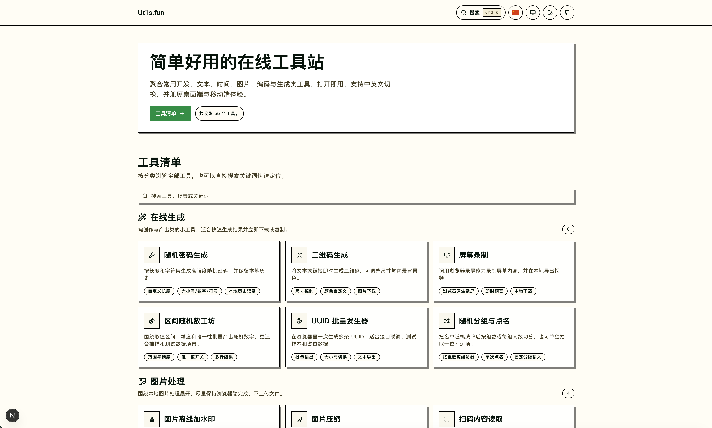

[简体中文](./README.md) | English

# Utils.fun

## Project Focus

Many toolbox sites are not short on pages. The real issue is that the tools people use most often are hard to find, overloaded with noise, or not reliable enough for repeat use. `Utils.fun` is designed as a cleaner long-term foundation instead of a pile of loosely related utilities.



## Highlights

- `55` tools organized into `8` categories with both category browsing and direct search
- Chinese is the default experience, while English lives under a dedicated `/en` route
- Most text, dev, conversion, encoding, finance, and image tools run locally in the browser
- Code-oriented tools use `Monaco Editor` for JSON, SQL, HTML, CSS, JS, and related workflows
- Site branding is centralized in `public/site-config.json`, which remains editable after build
- Desktop and mobile share the same information architecture and tool catalog

## Categories

- `Generate`
- `Image`
- `Encrypt`
- `Time`
- `Convert`
- `Finance`
- `Text`
- `Dev`

## Tech Stack

- `Next.js 16`
- `React 19`
- `TypeScript`
- `Tailwind CSS v4`
- `Monaco Editor`
- `dayjs`
- `crypto-js`
- `sql-formatter`
- `browser-image-compression`

## Getting Started

### 1. Install dependencies

```bash
npm install
```

### 2. Start the dev server

```bash
npm run dev
```

Open [http://localhost:3000](http://localhost:3000) in your browser.

### 3. Lint and build

```bash
npm run lint
npm run build
```

## Scripts

- `npm run dev`: start the local development server
- `npm run lint`: run ESLint
- `npm run build`: build the production app
- `npm run start`: start the production server

## Project Structure

```text
.
├─ app/
│  ├─ (tools)/
│  ├─ en/
│  ├─ pages/
│  ├─ layout.tsx
│  ├─ page.tsx
│  └─ sitemap.ts
├─ components/
│  ├─ ui/
│  ├─ tool-explorer.tsx
│  ├─ tool-sidebar.tsx
│  ├─ tool-search-dialog.tsx
│  └─ tool-workbench.tsx
├─ lib/
│  ├─ i18n.ts
│  ├─ locale.ts
│  ├─ locale-server.ts
│  ├─ site.ts
│  └─ tools.ts
├─ public/
│  ├─ favicon.ico
│  └─ site-config.json
└─ package.json
```

## Key Files

- `lib/tools.ts`: core metadata for categories, tool slugs, titles, descriptions, and highlights
- `components/tool-workbench.tsx`: the main interaction layer and local processing logic for each tool
- `app/pages/home-page.tsx`: the homepage entry for the full tool catalog
- `app/pages/tool-page.tsx`: the tool detail layout and work area shell
- `lib/i18n.ts`: shared site-level dictionary content
- `lib/locale.ts`: bilingual route helpers and locale preference persistence
- `public/site-config.json`: the runtime config file for title, description, logo, footer, and repository settings

## Bilingual Routing

- [README.md](./README.md) is the default Chinese documentation
- `README.en.md` is the English companion document
- `/` is the default Chinese entry
- `/en` is the English entry
- Locale preference is persisted with the `utilsfun-locale` cookie

## Recommended Flow for Adding a Tool

1. Add the `ToolSlug`, metadata, and category mapping in `lib/tools.ts`
2. Map the tool icon in `components/tool-icon.tsx`
3. Register the tool implementation in `components/tool-workbench.tsx`
4. Extract larger logic into dedicated components or helpers when needed
5. Complete both Chinese and English copy
6. Run `npm run lint` and `npm run build`

## Site Configuration

Site-level branding and base settings live in `public/site-config.json`, and the app reads it at runtime so you can still change it after build:

- `title`: site title
- `titleSeparator`: page title separator
- `description`: site description
- `url`: production URL
- `logo`: header logo
- `footerHtml`: footer HTML
- `githubUrl`: GitHub repository URL

Post-build workflow:

- The default config file path is `public/site-config.json`
- Update this file and restart the server to apply the new settings
- If you prefer another location, set `SITE_CONFIG_PATH` to point to a custom config file

## Contributing

Issues and pull requests are welcome. If you are contributing a new tool, it helps to include:

- what problem the tool solves
- whether it works fully locally
- whether it adds dependencies and why they are necessary
- whether both Chinese and English copy are complete
- whether `npm run lint` and `npm run build` pass

## License

This repository is released under the [MIT License](./LICENSE).

You are free to use, modify, distribute, and commercialize the project as long as the original copyright notice and license text are retained.
